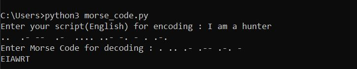

Use this program to translate input English strings into Morse-Code and vice versa!

The program uses simple Python Dictionary to create a relationship (key-value pair) between English alphanumersals and their Morse Code counterparts.

Have fun forking the repository and playing with the code

# Output:

